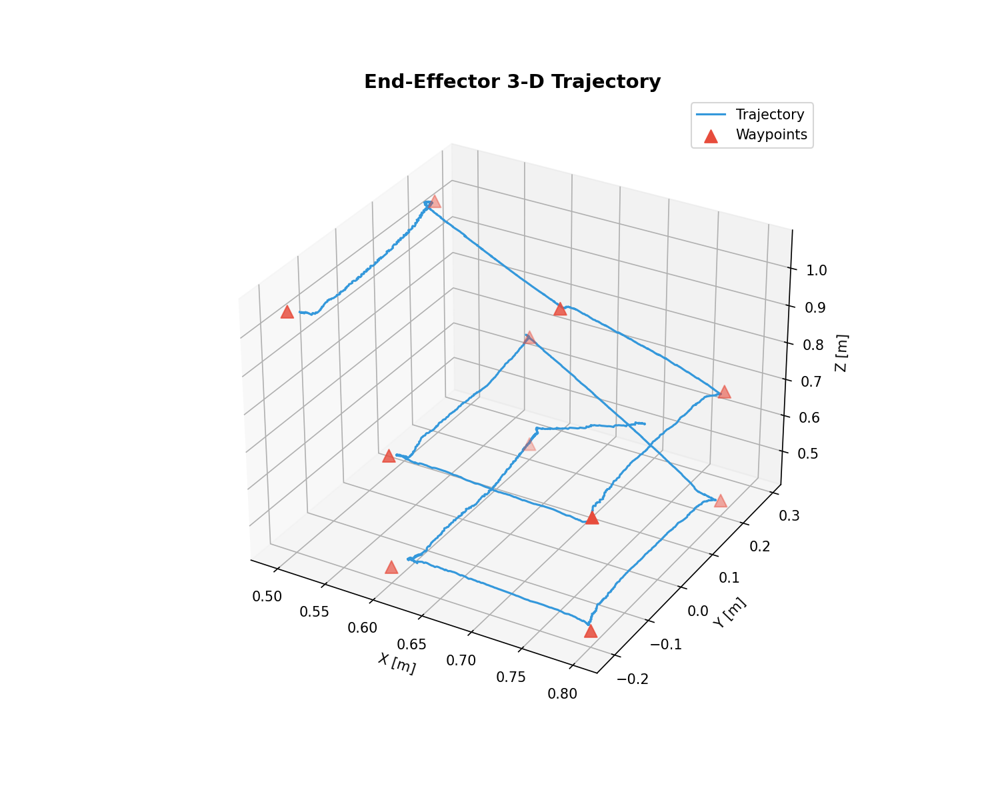
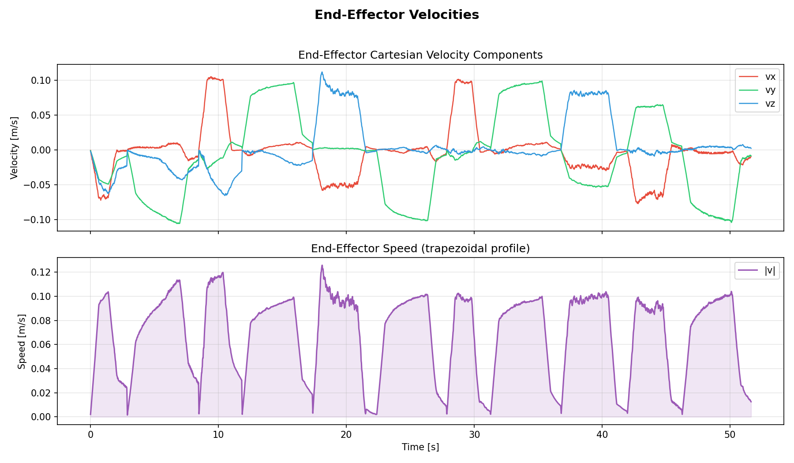
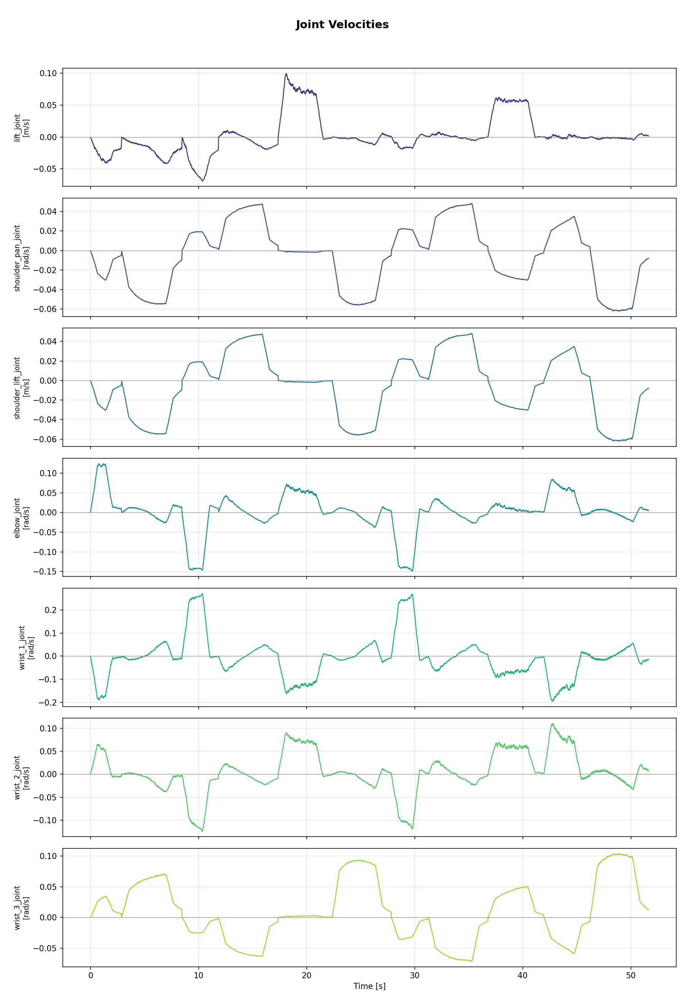

# Cartesian Motion with Vertical Lift

## Objective

Simulate and control smooth Cartesian motions of a 6-DOF robotic arm (UR10e)
mounted on a vertical prismatic joint (a lift), enabling it to reach points in
a 3D workspace.  Ensure constant-velocity Cartesian motion on a 2D plane at
varying heights, using trapezoidal velocity profiles.



## Project Structure
- **ur_description**: Contains the official UR10e robot description.
- **config/**: Contains the yaml file with the coordinates the end-effector needs to go to at 3 varying heights(z).
- **launch/**: Contains Python launch files for different robot configurations as mentioned above.
- **model/**: Robot description files, which draws the meshes etc from the ur_description folder.
- **world/**: Gazebo world files (SDF), currently only an empty world with just the floor and the compliance wall.
- **prismatic_7dof_sim/**: Contains Python files running the core logic of waypopint navigation, velocity tracker and plotter and executing the Cartesian motion of the end-effectot.
- **rviz/**: Just a saved Rviz view for the robot arm simulated in gazebo.


## Installation and Usage


```bash
# Clone the repository
git clone https://github.com/AnimeshM21/origin.git
cd origin

# Source ROS 2 Humble
source /opt/ros/humble/setup.bash

# Build the workspace
colcon build --symlink-install
source install/setup.bash

# Run the full demo (Gazebo + RViz + controller + plotting)
ros2 launch prismatic_7dof_sim cartesian_demo.launch.py

# Or run the simulation and controller separately
ros2 launch prismatic_7dof_sim sim.launch.py

# In another terminal
source /opt/ros/humble/setup.bash
cd origin
source install/setup.bash
ros2 run prismatic_7dof_sim cartesian_waypoint_tracker

# View the generated plots
ls /tmp/prismatic_plots/
eog /tmp/prismatic_plots/ee_velocities.png
```




## Dependencies

| Package | Purpose |
|---------|---------|
| ROS 2 Humble | Middleware |
| Ignition Fortress | Physics simulation |
| ros_gz_bridge | Gazebo ↔ ROS 2 topic bridging |
| PyKDL | Kinematics (FK, Jacobian, IK) |
| matplotlib | Velocity plots |
| numpy | Numerical computation |



## Configuration

Edit `config/waypoints.yaml` to change waypoints or velocity profile parameters.

Key parameters:
- `cart_v_max` — maximum end-effector Cartesian speed (m/s)
- `cart_a_max` — acceleration / deceleration (m/s²)
